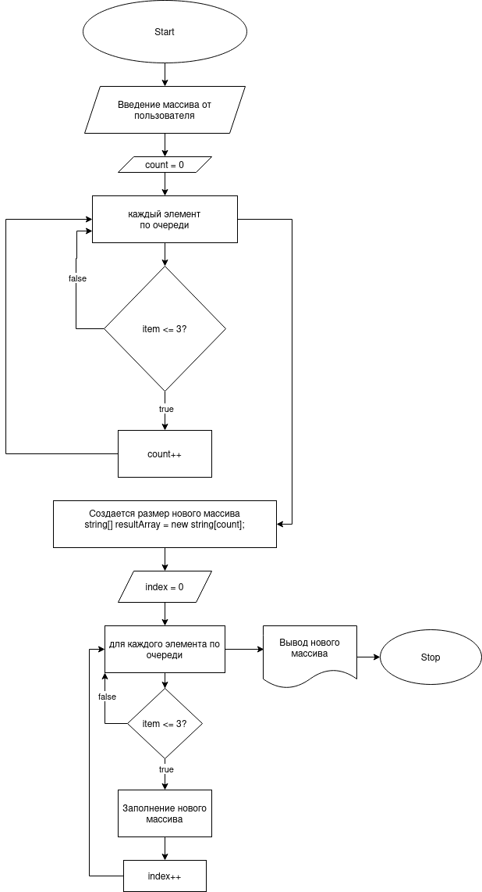

Привет!!!

**Перед вами написанный мною программа, которая из имеющегося массива строк формирует новый массив из строк, длина которых меньше, либо равна 3 символам.**

Чтобы её запустить необходимо:
1. Ввести dotnet run
2. Ввести массив на ваше усмотрение через запятую
3. Нажав ENTER код сработает и выдаст вам желаемый результат.

*Ниже можете наблюдать блок схему этого кода:* 

**Спасибо за внимание!**